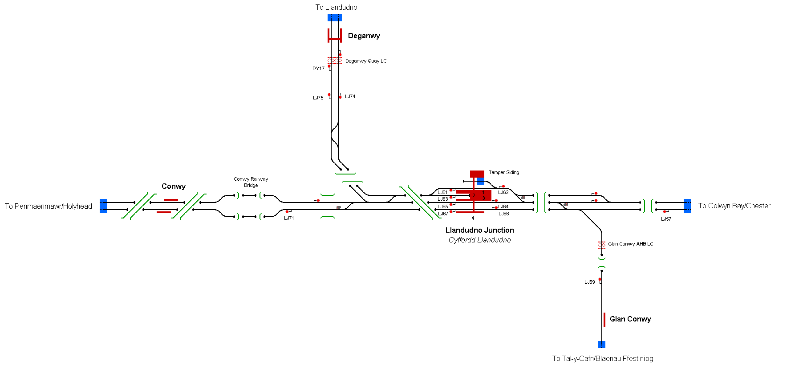

# Railway Operation Simulator Template Map 

This is a small simulation representating the area around Llandudno Junction in North Wales, UK. The map includes junctions towards Llandudno and Blaenau Ffestiniog and is indended as an easier simulation to operate.

## Current Status

| Stage         | Status        |
| ------------- |:-------------:|
| Track Plan     | :heavy_check_mark: |
| Signalling      | :heavy_check_mark:      |
| Naming | :heavy_check_mark:      |
| Speed Limits | :heavy_check_mark: |
| Distances | :heavy_check_mark: |
| Timetable | :heavy_check_mark: |
| Documentation | :x: |

## Data Sources

- [Blaenau Ffestiniog to Llandudno Jn - Cab Ride Experience](https://www.youtube.com/watch?v=twszvw9kz-s), Track Access Portal, YouTube
- [DRIVERS EYE VIEW | From Llandudno junction to Llandudno](https://www.youtube.com/watch?v=LCoC04pGy-E), Rusty Rails Modelling, YouTube
- [Cab Ride Crewe - Holyhead 1987](https://www.youtube.com/watch?v=4YhbM4LKSuU&t), Archive Ed, YouTube 
- [ABC Railway Guide](http://abcrailwayguide.uk/), for infrastructure naming
- [Map Meurisse](https://map.meurisse.org/), for distances
- [Western and Wales Sectional Appendix August 2020](https://sacuksprodnrdigital0001.blob.core.windows.net/sectional-appendix/Sectional%20Appendix%20full%20PDFs/Western%20and%20Wales%20Sectional%20Appendix%20August%202020.pdf)
